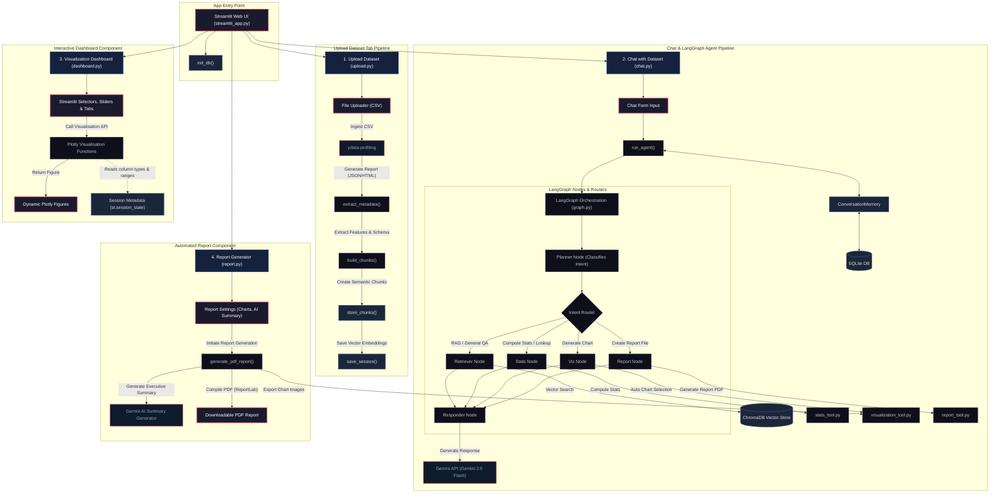

# NulAware AI

NulAware AI is an interactive data profiling assistant built with Streamlit, ChromaDB, and Gemini. It enables CSV upload, automated dataset profiling, semantic retrieval, natural-language Q&A, visual analytics, and PDF report generation.

## 🚀 Live Demo

- 🌐 Deployment: https://huggingface.co/spaces/yaliniBabukannan/Nullaware
- 🎥 Demo Video: https://www.loom.com/share/6c8b70b09c4e4560a654f7bfcb53153e

## Key Features

- CSV dataset upload and profiling
- Automatic metadata extraction and data quality scoring
- Semantic retrieval with ChromaDB + embeddings
- Natural-language chat questions about datasets
- Interactive visualization dashboard
- PDF report generation with AI executive summary
- Conversation history and dataset sessions persisted in SQLite


## 📊 System Architecture & Control Flow Diagram



### 🔗 Control Flow & Component Summary

- **Main Entrypoint**: [streamlit_app.py](file:///d:/NullAware/Nulaware-NL-Profiling/Project/frontend/streamlit_app.py) handles initial layout styles and page configurations and runs SQLite `init_db()` in [sqlite_manager.py](file:///d:/NullAware/Nulaware-NL-Profiling/Project/backend/database/sqlite_manager.py).
- **Upload Pipeline**: [upload.py](file:///d:/NullAware/Nulaware-NL-Profiling/Project/frontend/tabs/upload.py) uploads CSV -> calls `ydata-profiling` in [generate_profile.py](file:///d:/NullAware/Nulaware-NL-Profiling/Project/backend/profiling/generate_profile.py) -> extracts metadata in [extract_profile.py](file:///d:/NullAware/Nulaware-NL-Profiling/Project/backend/profiling/extract_profile.py) -> chunks elements in [chunker.py](file:///d:/NullAware/Nulaware-NL-Profiling/Project/backend/rag/chunker.py) -> stores embeddings in ChromaDB vector store via [chromadb_store.py](file:///d:/NullAware/Nulaware-NL-Profiling/Project/backend/rag/chromadb_store.py).
- **LangGraph Agent**: [chat.py](file:///d:/NullAware/Nulaware-NL-Profiling/Project/frontend/tabs/chat.py) triggers `run_agent()` inside the compiled LangGraph workflow defined in [graph.py](file:///d:/NullAware/Nulaware-NL-Profiling/Project/backend/agents/graph.py). Intent parsing is handled by [planner.py](file:///d:/NullAware/Nulaware-NL-Profiling/Project/backend/agents/planner.py) and context memory by [memory.py](file:///d:/NullAware/Nulaware-NL-Profiling/Project/backend/agents/memory.py).
- **Plotly Visuals**: [dashboard.py](file:///d:/NullAware/Nulaware-NL-Profiling/Project/frontend/tabs/dashboard.py) coordinates with [visualization_tool.py](file:///d:/NullAware/Nulaware-NL-Profiling/Project/backend/tools/visualization_tool.py) to render interactive graphs directly to Streamlit tabs.
- **Document Output**: [report.py](file:///d:/NullAware/Nulaware-NL-Profiling/Project/frontend/tabs/report.py) calls [report_tool.py](file:///d:/NullAware/Nulaware-NL-Profiling/Project/backend/tools/report_tool.py) to compile ReportLab PDF data quality documents, supplemented by Gemini insights from [gemini_manager.py](file:///d:/NullAware/Nulaware-NL-Profiling/Project/backend/llm/gemini_manager.py).

---

## Project Structure

- `frontend/`
  - `streamlit_app.py` — app entry point
  - `tabs/` — UI screens for upload, chat, dashboard, and report
- `backend/`
  - `agents/` — intent classification, conversation memory, agent orchestration
  - `rag/` — semantic chunking, embeddings, ChromaDB storage, retrieval
  - `database/` — SQLite session and conversation persistence
  - `profiling/` — dataset profiling and profile extraction
  - `tools/` — stats, visualization, report generation utilities
  - `llm/` — Gemini integration and LLM call wrappers
- `storage/` — persistent uploads, profile JSON, reports, charts, and ChromaDB store
- `tests/` — unit tests for planner, profiling, and tools
- `config.py` — centralized configuration and path management
- `prompts.py` — LLM prompt templates for RAG, insights, and reporting
- `requirements.txt` — Python dependency list

## How It Works

1. Upload a CSV file through the **Upload** tab.
2. The app generates a ydata-profiling report and extracts dataset metadata.
3. Metadata is split into semantic chunks, embedded, and stored in ChromaDB.
4. In the **Chat** tab, questions are routed by the intent planner to the right action.
5. The app retrieves relevant chunks for general questions, then uses Gemini to answer with sources.
6. The **Dashboard** tab offers charts like histograms, boxplots, scatter plots, and missing value analysis.
7. The **Report** tab generates a PDF with charts, quality metrics, and optional AI-written summary.

## Workflow

1. **Upload & ingest**
   - CSV file is saved to `storage/uploads`.
   - `frontend.tabs.upload` loads the file into pandas and previews rows/columns.
   - `backend.profiling.generate_profile` creates a full dataset profile.
   - `backend.profiling.extract_profile` extracts structured metadata from the profile JSON.

2. **Semantic indexing**
   - `backend.rag.chunker.build_chunks` converts dataset metadata into semantic text chunks.
   - Chunks cover dataset summary, each column, correlations, missing values, outliers, and duplicates.
   - `backend.rag.chromadb_store.store_chunks` embeds text and saves vectors in a dataset-scoped ChromaDB collection.

3. **Persistence**
   - Session metadata, report paths, and upload details are saved in SQLite using `backend.database.sqlite_manager`.
   - Conversation history is also persisted for multi-turn context and review.

4. **Chat & agent routing**
   - `frontend.tabs.chat` sends questions to `backend.agents.graph.run_agent`.
   - `backend.agents.planner.classify_intent` determines whether to answer from RAG, statistics, visualization, report generation, or row lookup.
   - `backend.agents.memory.ConversationMemory` resolves pronouns and maintains chat context.
   - Relevant chunks are retrieved from ChromaDB, and Gemini is called for natural-language responses.

5. **Visualization & dashboard**
   - `frontend.tabs.dashboard` displays interactive Plotly charts generated by `backend.tools.visualization_tool`.
   - Supported visuals include overview dashboards, histograms, boxplots, scatter plots, heatmaps, bar charts, pie charts, and missing value charts.

6. **Report generation**
   - `frontend.tabs.report` produces a PDF report using `backend.tools.report_tool`.
   - The report can embed chart images, data quality metrics, missing values, correlations, outliers, and an optional AI-written executive summary.

## Architecture Details

- `frontend/streamlit_app.py` is the Streamlit entry point and page layout manager.
- `frontend/tabs/` contains the four primary UI workflows: upload, chat, dashboard, and report.
- `backend/agents/` orchestrates intent planning, retrieval, visualization, report generation, and response formatting.
- `backend/rag/` handles chunking, embeddings, ChromaDB collection management, and retrieval.
- `backend/database/` manages SQLite tables for conversation history and dataset sessions.
- `backend/profiling/` builds ydata-profiling reports and extracts usable profile metadata.
- `backend/tools/` includes data quality scoring, automatic insights, visualization rendering, report assembly, and row lookup tools.
- `backend/llm/` integrates with Gemini and supports round-robin key rotation and retry handling.

## Setup

1. Create a virtual environment and install dependencies:

```bash
python -m venv .venv
.venv\Scripts\activate
pip install -r requirements.txt
```

2. Create a `.env` file in the project root with your Gemini API keys:

```env
GEMINI_API_KEY_1=your_api_key_here
GEMINI_API_KEY_2=...
```

3. Run the Streamlit app:

```bash
streamlit run frontend/streamlit_app.py
```

## Configuration

See `config.py` for environment-driven settings:

- `UPLOAD_DIR` — dataset upload path
- `PROFILE_JSON_DIR` — profile JSON storage
- `REPORTS_DIR` — PDF report output
- `CHARTS_DIR` — chart image cache
- `CHROMA_PERSIST_DIR` — ChromaDB persistence directory
- `SQLITE_DB_PATH` — SQLite database file
- `GEMINI_MODEL` — LLM model selection
- `EMBEDDING_MODEL` — embedding model selection
- `RAG_TOP_K` — number of retrieval results

## Notes

- The app currently supports CSV ingestion only.
- The `frontend` UI is designed as a single-page Streamlit app with sidebar navigation.
- Dataset sessions and conversation history are stored via SQLite.
- ChromaDB is used for semantic retrieval and dataset indexing.

## Running Tests

Use the included test files in `tests/` for unit coverage:

```bash
pytest tests
```

## License

NullAware AI License.


